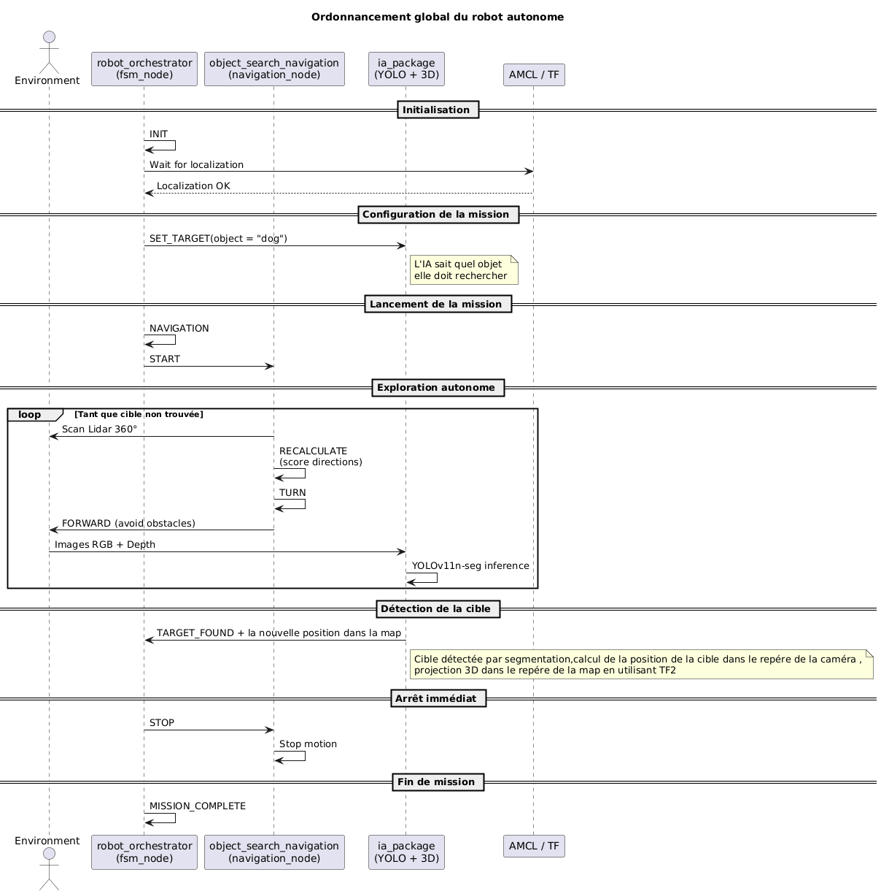

# Autonomous Object Search System

## Project Overview
This project involves developing a mobile robot capable of exploring an environment to find a specific object (e.g., dog, cat, bottle, etc.) completely autonomously.

### The Concept
The robot combines **Autonomous Exploration** and **Artificial Intelligence**.
1.  It **explores** the room while avoiding walls.
2.  It visually **detects** its target using a camera.
3.  It **stops**, localizes the object on the map, and reports the object's coordinates in the map frame.

---

## System Architecture
The system relies on 3 ROS 2 Packages:

- **`ia_package`**: Object detection (YOLOv11) and 3D positioning in different frames (CAMERA and MAP).
- **`robot_orchestrator`**: State machine that controls the global mission.
- **`object_search_navigation`**: Exploration and obstacle avoidance algorithm.

### Mission Sequence
The diagram below illustrates the complete mission flow, from initialization to shutdown, and the interactions between the 3 packages and the environment:



---

## Installation & Quick Start

### Prerequisites

### 1. Prepare a Virtual Machine (If necessary)
- On Windows: VirtualBox (https://www.virtualbox.org)
- On MacOSX: UTM (https://mac.getutm.app)

### 2. Install Ubuntu 22.04 (Jammy Jellyfish)
- Download: https://releases.ubuntu.com/jammy/

! ARM image is required for Apple Silicon-based laptops,
- https://cdimage.ubuntu.com/releases/22.04/release/
- Only the server version is available… need to manually install GUI…

```bash
sudo apt update && sudo apt upgrade && sudo apt install ubuntu-desktop
```
Then reboot your computer.

### 3. Install ROS 2 Humble
Follow the official procedure or use the commands below for a quick installation of necessary packages.

```bash
sudo apt install ros-humble-ros-gz
sudo apt install ros-humble-nav2-map-server
sudo apt install ros-humble-cartographer
sudo apt install ros-humble-cartographer-ros
sudo apt install ros-humble-navigation2
sudo apt install ros-humble-nav2-bringup
sudo apt install ros-humble-turtlebot3-msgs
sudo apt install ros-humble-xacro
```

Next, install **Colcon** (the standard ROS 2 compiler):

```bash
sudo apt install python3-colcon-common-extensions python3-argcomplete libboost-system-dev
```

Finally, install **Cyclone DDS**:

```bash
sudo apt install ros-humble-rmw-cyclonedds-cpp
```

### Shell Configuration (bashrc)
To make ROS 2 accessible in every new terminal and to use CycloneDDS for robot communication, execute this once:

```bash
echo "source /opt/ros/humble/setup.bash" >> ~/.bashrc

echo "export RMW_IMPLEMENTATION=rmw_cyclonedds_cpp" >> ~/.bashrc

source .bashrc

# Verify variables are loaded
printenv | grep -i ROS
```

Verify if any system dependencies are missing and install them:

```bash
sudo apt install build-essential
sudo apt install python3-rosdep
sudo rosdep init
rosdep update
```

Verify that the ROS 2 installation works:

```bash
ros2
# usage: ros2 [-h] ...
# ros2 is an extensible command-line tool for ROS 2.
```

### 4. Install Gazebo

This project uses **Gazebo Ignition Fortress** compatible with ROS2 Humble.
```bash
sudo apt install ros-humble-ros-gz

# Verify installation
ign gazebo --version
# Should display: Gazebo Sim, version 6.x.x
```

> **Note**: Do not confuse with `gazebo` (Gazebo Classic) or `gz` (Gazebo Garden+).
> This project uses `ign gazebo` (Ignition Fortress).

Official Documentation: https://gazebosim.org/docs/fortress/install_ubuntu

---

## Simulation Installation (Gazebo)

### 1. Clone the Project
```bash
git clone https://github.com/komi-assimpah/Autonomous_intelligent_systems.git

cd Autonomous_intelligent_systems
```

### 2. Install Dependencies

```bash
# 1. Build tools
sudo apt install python3-vcstool python3-colcon-common-extensions -y

# 2. Create a Python virtual environment
python3 -m venv venv
source venv/bin/activate

# 3. Fetch sub-repositories (TurtleBot3, Dynamixel...)
vcs import < dependencies.repos

# 4. Install ROS dependencies
sudo apt update
rosdep install --from-paths src --ignore-src -r -y

# 5. Install Python libs (YOLO, etc.)
pip install -r requirements.txt
```

### 3. Build
```bash
colcon build
# ... (this may take a while) ...

source install/setup.bash
```

### 4. Configure Environment
In every new terminal opened before launching the robot, run these commands:
```bash
source venv/bin/activate
export TURTLEBOT3_MODEL=burger
source /opt/ros/humble/setup.bash
source install/setup.bash
```

Or add an alias to your `~/.bashrc`

### 5. Launch Simulation
Launch Gazebo, RViz, and all intelligence with the command:
```bash
ros2 launch robot_orchestrator orchestrator.launch.py sim:=true
```

By default, it searches for a dog. To specify a target object, ensure the previous simulation is completely stopped, then launch:

```bash
# To search for a specific object
ros2 launch robot_orchestrator orchestrator.launch.py sim:=true target_class:='target_class_name'

# Examples:
# To search for a dog
ros2 launch robot_orchestrator orchestrator.launch.py sim:=true target_class:='dog'

# To search for a cat
ros2 launch robot_orchestrator orchestrator.launch.py sim:=true target_class:='cat'
```

If the object is not supported by the search model, an error will appear in the terminal listing all supported classes.

---

## Real Robot Installation (TurtleBot3)

> **Note**: This section is currently under validation.