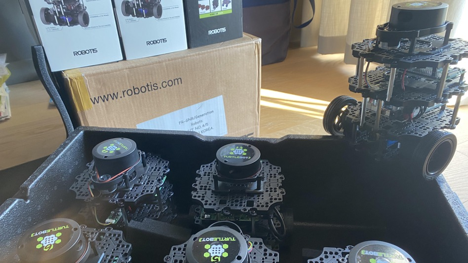

[![ubuntu22][ubuntu22-badge]][ubuntu22]
[![humble][humble-badge]][humble]

# Simple ROS2 packages to play around with the Robotis Turtlebot3 burger platform



## Host Configuration Steps (VM + Ubuntu 22.04 + ROS2 Humble)
### Install a virtual machine:
- On windows : VirtualBox (https://www.virtualbox.org)
- On MacOSX  : UTM (https://mac.getutm.app)

### Configure the virtual machine with Ubuntu 22.04 desktop image
- https://releases.ubuntu.com/jammy/<br>
⚠️ ARM image is required for Apple Silicon-based  hosts
    - https://cdimage.ubuntu.com/releases/22.04/release/
    - Only the server version is available… need to manually install GUI…  
      ```bash
      $> sudo apt update & sudo apt upgrade & sudo apt install ubuntu-desktop
      ```

### Install ROS2 Humble
- A good resource here : https://foxglove.dev/blog/installing-ros2-humble-on-ubuntu (install ros2 desktop version)
- Also install colcon, the ROS2 package compiler, and cylone DDS:
    ```bash
    $> sudo apt install python3-colcon-common-extensions ros-humble-rmw-cyclonedds-cpp
    ```
- Configure the host  
    ```bash
    $> echo "source /opt/ros/humble/setup.bash" >> ~/.bashrc
    $> echo "export RMW_IMPLEMENTATION=rmw_cyclonedds_cpp" >> ~/.bashrc
    $> source ~/.bashrc
    $> printenv | grep -i ROS
    ```
- Verify ROS2 installation  
    ```bash
    $> ros2  
    usage: ros2 [-h] [--use-python-default-buffering] Call ‘ros2 <command> -h’ for more detailed usage. …  
    ros2 is an extensible command-line tool for ROS 2.  
    …  
    ```  
### Setup a workspace
- Install & configure rosdep tool and dependencies
    ```bash  
    $> sudo apt install build-essential python3-rosdep
    $> sudo rosdep init
    $> rosdep update
    $> mkdir -p ~/ros2_ws/src
    ```
- One can also install Foxglove
    - Retrieve the deb archive from https://foxglove.dev/download then,
    ```bash  
    $> sudo dpkg -i foxglove-studio-latest-linux-<arch>.deb
    $> sudo apt install ros-$ROS_DISTRO-foxglove-bridge
    ```
    - Create a Foxlove account (https://foxglove.dev) and sign-in. Then,
    ```bash
    $> foxglove-studio &
    ```
    - Accept the device registration from the webpage.
    - Finally, start the Foxglove bridge:
    ```bash
    $> ros2 launch foxglove_bridge foxglove_bridge_launch.xml
    ```      
        
## Host Configuration Steps (ROS2 specific packages + Robotis Turtlebot3 ROS2 packages)
```bash 
$> sudo apt install ros-humble-ros-gz ros-humble-cartographer ros-humble-cartographer-ros ros-humble-navigation2 ros-humble-nav2-bringup
$> cd ~/ros2_ws/src
$> git clone -b humble https://github.com/ROBOTIS-GIT/DynamixelSDK.git
$> git clone -b humble https://github.com/ROBOTIS-GIT/turtlebot3_msgs.git
$> git clone -b humble https://github.com/ROBOTIS-GIT/turtlebot3.git
$> cd ~/ros2_ws
$> colcon build
... (this may take a while) ...
$> echo 'source ~/ros2_ws/install/setup.bash' >> ~/.bashrc
$> echo 'export TURTLEBOT3_MODEL=burger' >> ~/.bashrc
$ source ~/.bashrc
```
- Finally, clone this repo:
 ```bash 
 $> cd ~/ros2_ws/src
 $> git clone https://github.com/gerald-rocher/Turtlebot3.git
 ```
 
[humble]: https://docs.ros.org/en/humble/index.html
[humble-badge]: https://img.shields.io/badge/-HUMBLE-orange?style=flat-square&logo=ros
[ubuntu22-badge]: https://img.shields.io/badge/-UBUNTU%2022%2E04-blue?style=flat-square&logo=ubuntu&logoColor=white
[ubuntu22]: https://releases.ubuntu.com/jammy/
